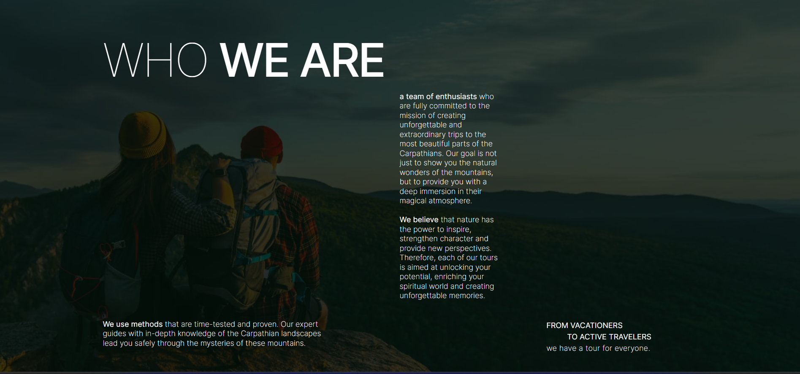
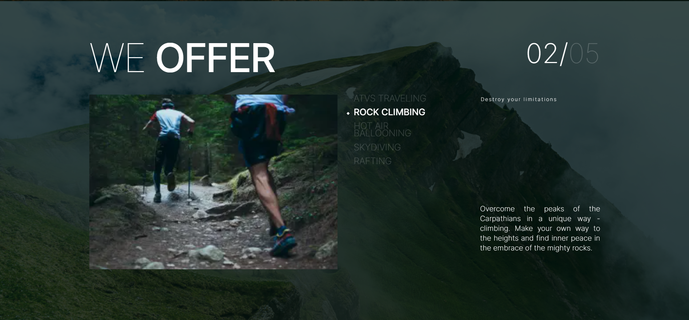
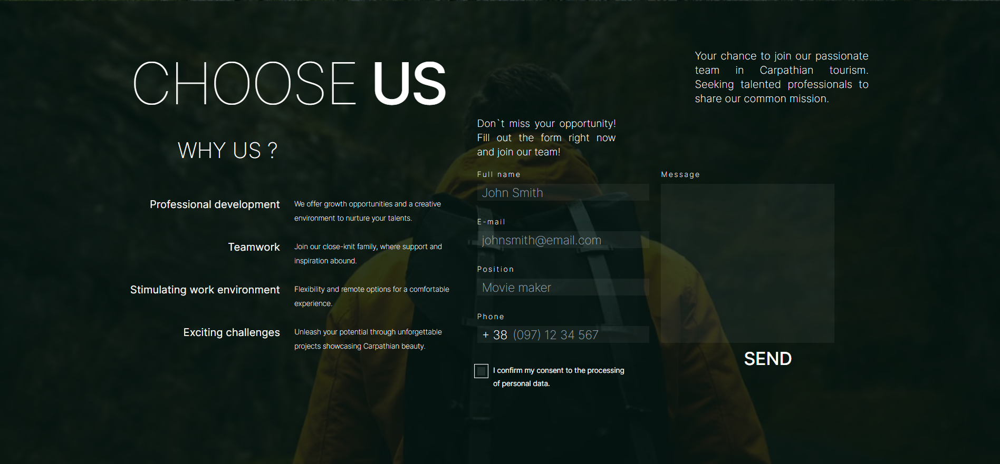
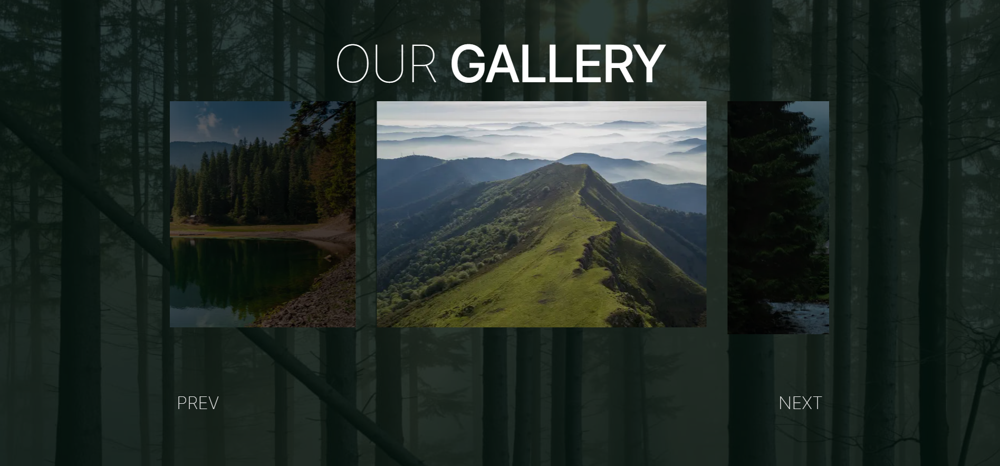
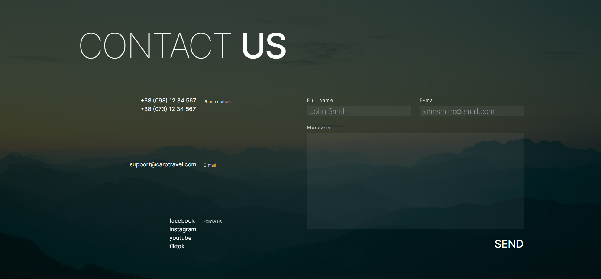

#  CarpTravel

### CarpTravel Web-site

To start working with the application, you need to open website [softryzen-test-task](https://softryzen-text-task-kyspq6ekx-dianaforost.vercel.app/)

## 📝 Опис проєкту

Сайт-візитка для створення особистого бренду та залучення нових клієнтів та
партнерів.

- **Назва проєкту**: CarpTravel

## 💪 Технічний стек

**Front-end:**

- Next.js ⏭️
- CSS framework: Tailwind 🎨
- Code quality and style: 🧹 `eslint`
- React library: ⚛️ `react`
- Form handling with React: 📝 `react-hook-form`
- Scrolling functionality: 📜 `react-scroll`
- Carousel component: 🎠 `swiper`

**Back-end:**

- Json 📄

## About

"About us" section for familiarization with the values and principles of the company

## Services

In the next block, we have 5 areas of entertainment, informative text about them and pictures that will help the user choose the desired vacation and learn a lot about it

## Career

In the next block we see an informative text that displays the main benefits associated with the brand and a feedback form with fields such as: "Name", "Mail", "Position", "Phone", "Message" and confirmation button for personal data processing.

## Gallery

In the Gallery block, the user will be able to see photos taken on vacation from this company. They are implemented in the form of a convenient slider, the user can swipe in both directions to view all reviews, or use the scroll bar below.

## Contacts

Let's go to the final part of the site, where there are contacts for communication, links to social networks, and a form that the user can fill in to register an application for the desired vacation or send their questions and suggestions. The form itself consists of 3 fields, namely "Name", "E-mail" and "Message", each of them is mandatory.

